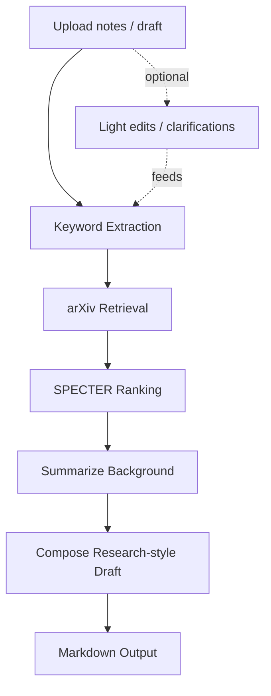

# Idea2Paper — Upload → auto‑find related papers → draft

A lightweight, **local-first** pipeline that helps you turn raw notes or experiment logs into a research‑style **Markdown draft**.  
It extracts **keywords** from your upload, retrieves relevant papers from **arXiv**, ranks them with **SPECTER**, summarizes the background, and assembles a structured draft you can edit and extend.

> **Credit request (no license added):** if this project helps you, please add a short acknowledgement in your paper or repo.  
> _“Built with the Idea2Paper pipeline (keyword→arXiv→SPECTER→summary→draft).”_

---

## Pipeline (abstract)



*This diagram intentionally keeps the flow abstract and independent of any specific PDF/full‑text step.*

---

## Why this exists
- When you start a new idea, you often need **fast background context** and a **coherent scaffold** to write from.
- This app aims to give you a **ranked list of related work** and a **background section** in minutes, locally.
- It avoids paid APIs; models come from **Hugging Face** and run **CPU or GPU** (CUDA if available).

---

## Features
- 📥 **Upload**: PDF/DOCX/TXT/MD/CSV (text extracted locally).
- 🏷️ **Keyword extraction** from your notes.
- 🔎 **arXiv retrieval** (no API key needed), then **SPECTER ranking**.
- ✂️ **Summarization** with `google/pegasus-arxiv` (switchable).
- 🧩 **Draft builder**: Background + short per‑paper synopses + references list.
- 🖥️ **Local-first**: no third‑party LLM APIs required.
- ⚙️ **GPU aware** (if `torch.cuda.is_available()`), otherwise CPU.

---

## Quick start

### 1) Clone and create a virtual environment
```bash
git clone https://github.com/<your-username>/Idea2Paper.git
cd Idea2Paper

# (Windows PowerShell)
python -m venv .venv
.venv\Scripts\Activate.ps1

# (macOS/Linux)
# python3 -m venv .venv
# source .venv/bin/activate
```

### 2) Install
```bash
pip install --upgrade pip wheel
pip install -r requirements.txt
```

> **GPU note (Windows/NVIDIA):**  
> Install a Torch build that matches your CUDA runtime. For example:
> ```powershell
> pip uninstall -y torch torchvision torchaudio
> pip install --index-url https://download.pytorch.org/whl/cu121 torch torchvision torchaudio
> ```
> If you hit the **CVE-2025-32434** warning loading HF weights, upgrade Torch to **2.6+**.

### 3) Run
```bash
streamlit run src/app.py
```
Open the local URL shown (e.g., `http://localhost:8502`).

---

## Usage (TL;DR)
1. **Upload** your notes/draft/experiment log.  
2. Click **Extract text & suggest keywords**. Edit if you like.  
3. **Retrieve** related arXiv papers.  
4. **Rank** with SPECTER. Inspect the table.  
5. **Summarize & Generate** → produces a Markdown draft, downloadable and saved under `drafts/`.

> You can tweak `Top K` and retrieval size in the left sidebar for speed vs depth.

---

## Configuration

Most knobs live in `src/config.py`. Important ones:

| Name | Default | Meaning |
|---|---:|---|
| `DEVICE` | auto (`cuda` if available) | Target device for models |
| `TOP_K` | 10 | How many top papers to use in the draft |
| `MAX_ARXIV_RESULTS` | 40 | How many arXiv results to fetch before ranking |
| `EMBED_MODEL` | `sentence-transformers/allenai-specter` | Paper embedding model |
| `SUM_MODEL` | `google/pegasus-arxiv` | Background summarizer |

You can also set environment variables:
```bash
# Force GPU (if available)
# Windows PowerShell
$env:IDEA2PAPER_DEVICE="cuda"

# bash/zsh
export IDEA2PAPER_DEVICE=cuda
```

---

## Folder layout
```
Idea2Paper/
├─ src/                # application code (Streamlit app + pipeline modules)
├─ drafts/             # generated Markdown drafts (kept out of git by .gitignore)
├─ data_samples/       # optional local sample docs (empty committed with .gitignore)
├─ notebook/           # optional demo/experiments
├─ flowchart/          # pipeline diagram source
├─ requirements.txt
├─ README.md
└─ .gitignore
```

---

## What I learned / current limitations

Even with GPU, **classic summarizers** (e.g., PEGASUS) can feel:
- ✅ Good at **high-level background**.
- ⚠️ Weak at **fine-grained, task‑specific writing** (method details, polished prose).  
- ⚠️ Sensitive to **noisy inputs** and long concatenations of abstracts.

This is **not** a drop‑in replacement for writing—think of it as a **bootstrap** that speeds up literature mapping and gives you a first background block to edit.

---

## Future work

- 🔁 Replace/augment PEGASUS with **modern instruction‑tuned LLMs** (local), with guardrails.
- 📄 Optional **full‑text ingestion** when available (pdf → text), with section‑aware summarization.
- 🧠 Better **keywording** (KeyBERT or in‑domain models).
- 🧷 Smarter **citation stitching** (dedupe authors/titles/years; BibTeX export).
- ⚡ **Caching** for re‑runs (arXiv + embeddings + summaries) to make iterative work snappier.
- 🧪 Add a **“write by sections”** mode (Background, Related Work, Approach, etc.).

---

## Troubleshooting

- **Torch vulnerability error** about `torch.load` → Update to **torch 2.6+** or use safetensors‑only weights.
- **CUDA not used** → Ensure the right **CUDA‑enabled torch wheel** is installed (see Quick start).
- **Slow runs** → Lower **Top K** to 5; reduce `MAX_ARXIV_RESULTS`; run on GPU; close heavy apps.
- **Windows PowerShell execution policy** blocks `.ps1` → run `Set-ExecutionPolicy -Scope CurrentUser RemoteSigned`.

---

## Give credit 🙌

I’m not adding a license for now. If this project helps you, please **add an acknowledgement** like:
> _“This work used the Idea2Paper pipeline (keyword→arXiv→SPECTER→summary→draft).”_

A star on GitHub also helps others find it. Thanks!

---

## Acknowledgements
- [arXiv](https://arxiv.org/)
- [SPECTER](https://www.specter.ai/) (allenai/`sentence-transformers/allenai-specter`)
- [PEGASUS](https://huggingface.co/google/pegasus-arxiv)
- [Sentence-Transformers](https://www.sbert.net/)
- [Hugging Face Transformers](https://huggingface.co/docs/transformers/index)
- [Streamlit](https://streamlit.io/)
