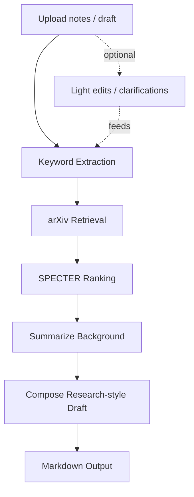

# Idea2Paper — Upload → arXiv → SPECTER → PEGASUS (non-LLM scientific drafts)


A lightweight pipeline that turns your own notes/experiment logs into a short, research‑style draft by:
- extracting **keywords** from your upload,
- pulling **related arXiv papers**,
- ranking them with **SPECTER** (semantic similarity),
- and summarizing the background with **PEGASUS‑arXiv** (abstracts or full‑PDFs).

No paid LLM keys required; models run locally via Hugging Face + PyTorch. Works on **CPU** or **CUDA** if available.

---

## ✨ Pipeline

## Pipeline (abstract)



*This diagram intentionally keeps the flow abstract and independent of any specific PDF/full‑text step.*

---

## 🚀 Quickstart (Windows)

```powershell
git clone https://github.com/<your-username>/Idea2Paper.git
cd Idea2Paper

# Create & activate venv
python -m venv .venv
. .venv/Scripts/activate

# Install deps
pip install --upgrade pip
pip install -r requirements.txt

# Run the Streamlit app
streamlit run src/app.py
```

### GPU (optional)
If you have an NVIDIA GPU, CUDA Toolkit/Driver installed:
- The app auto‑detects CUDA. You can force it via env var:
  ```powershell
  set IDEA2PAPER_DEVICE=cuda
  ```
- Models will use **fp16** on GPU to save VRAM and speed up generation.

> **Torch vulnerability notice:** Some Transformers checkpoints require `torch>=2.6` (or safetensors) because of a security fix (CVE‑2025‑32434). If you hit a “please upgrade torch” error, use:
> ```powershell
> pip install --upgrade "torch>=2.6" --index-url https://download.pytorch.org/whl/cu121  # choose cu version to match your CUDA
> ```

---

## 🗂️ Repository Layout

```
Idea2Paper/
├─ flowchart/                  # Mermaid diagram(s) for the README
│  └─ pipeline.md
├─ data_samples/               # (Empty in repo; add your own test files) 
├─ drafts/                     # Generated drafts (git-ignored)
├─ notebook/
│  └─ demo.ipynb               # Optional smoke tests / quick experiments
├─ src/
│  ├─ app.py                   # Streamlit UI
│  ├─ config.py                # Central configuration
│  ├─ ingest.py                # Upload parsing (pdf/docx/txt/md/csv)
│  ├─ keywords.py              # Keyphrase extraction
│  ├─ retrieval.py             # arXiv query builder + fetch
│  ├─ ranker.py                # SPECTER-based re-ranking
│  ├─ summarizer.py            # PEGASUS summarization (abstracts / full-PDF)
│  ├─ generator.py             # Compose Markdown draft
│  ├─ utils.py                 # Helpers
│  └─ fulltext.py              # (Optional) PDF extraction helper
├─ .gitignore
├─ requirements.txt
└─ README.md
```

---

## ⚙️ Config (important knobs)

All tunable via `src/config.py` or environment variables:

- `DEVICE` — `"cuda"` or `"cpu"` (auto-detected; override with `IDEA2PAPER_DEVICE`)
- `TOP_K` — how many top ranked papers to use in the draft
- `MAX_ARXIV_RESULTS` — how many raw arXiv results to fetch before ranking
- `USE_FULL_PDFS` — `true/false` (if `true`, attempt to download & summarize full PDFs)
- `PDF_TIMEOUT`, `PDF_MAX_BYTES`, `PDF_CHAR_CAP` — safety rails for PDF downloads
- `SUM_MODEL` — default summarizer (`google/pegasus-arxiv`)
- `EMBED_MODEL` — SPECTER encoder (`sentence-transformers/allenai-specter`)

---

## ✅ What works well

- No API keys needed; local semantic ranking + summarization
- RAG based on your upload + arXiv related work
- Simple UI that makes it easy to iterate and save drafts

## 😕 What disappointed me

- The generated “paper” is concise and **not** as rich as LLM‑assisted drafts.
- Quality depends heavily on upload clarity and arXiv retrieval.
- Full‑PDF extraction can be slow/unreliable depending on source PDFs.

## 🧭 Roadmap / ideas to improve

- Swap to a **local instruction‑tuned LLM** (Ollama) for drafting & section structure
- **Citation scraping** and reference formatting (BibTeX export)
- Domain‑specific rankers (SciBERT, multi‑query retrieval, category filters)
- Smarter **hierarchical long‑context** summarization across multiple PDFs with chunk memory
- Better PDF parsing (layout‑aware extraction / figure caption mining)

---

## 🧰 Troubleshooting

- **CUDA found but slow?** Some models still do heavy tokenization on CPU; that’s expected. You can still speed up generation by using fp16 on GPU.
- **Transformers says “upgrade torch”?** Install `torch>=2.6` or switch to safetensors‑only models.
- **arXiv returns zero results?** Tweak keywords; try fewer/more general terms.

---

## 🤝 Credit

No license file right now. If you use this repo in your work or demos, a short credit like
> “Built on *Idea2Paper* (https://github.com/Sivarohitk/Idea2Paper)”  
is highly appreciated.
